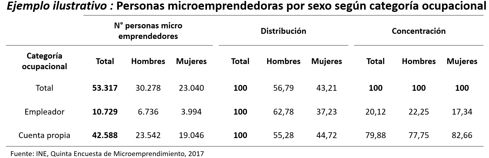
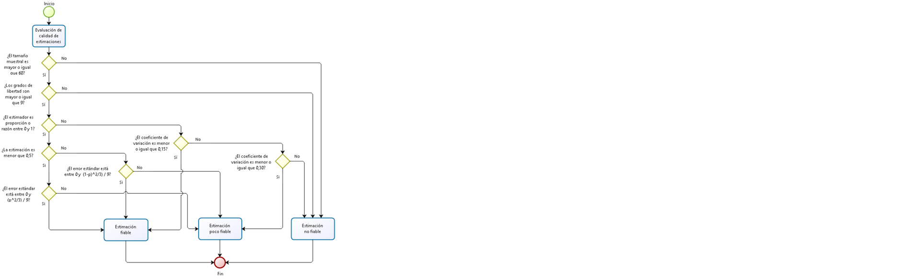
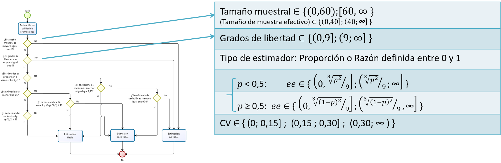
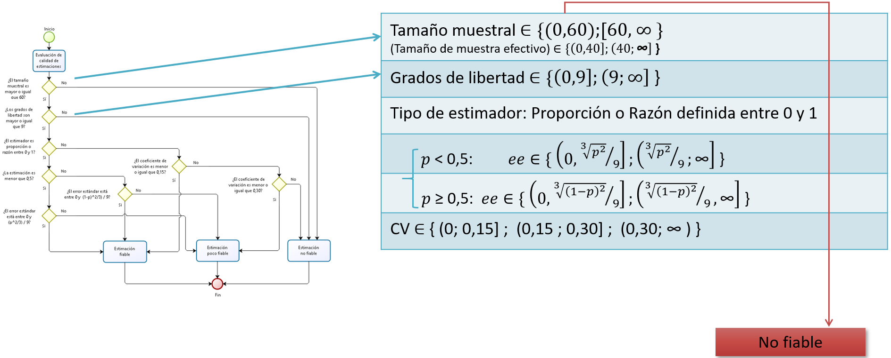
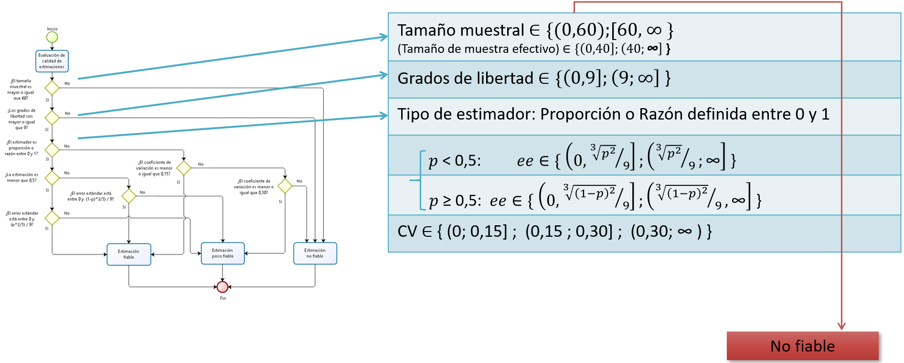
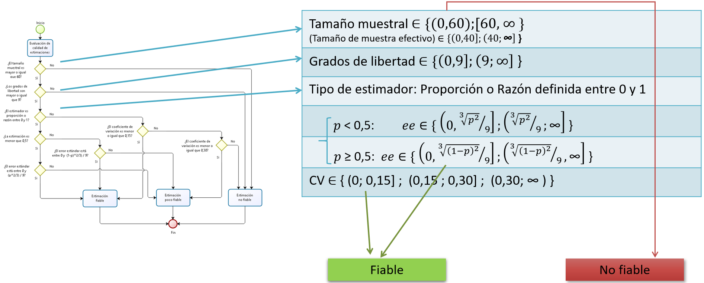
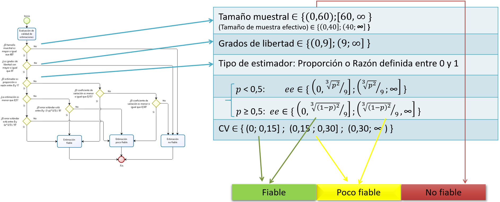

class: center, middle

.linea-superior[]
.linea-inferior[]


## Presentación paquete calidad

## Proyecto Estratégico Servicios Compartidos para la Producción Estadística

### Octubre 2021

```{r setup, include=FALSE}
options(htmltools.dir.version = TRUE)
knitr::opts_chunk$set(message = FALSE, warning = F) 
options(scipen = "999")
```

```{r xaringan-themer, include=FALSE, warning=FALSE}
library(xaringanthemer)
```

---
background-image: url("imagenes/fondo2.PNG")
background-size: contain;
background-position: 100% 0%

# Contenidos de la presentación

- Estándar de calidad INE

- Estándar de calidad CEPAL

- Paquete de R para implementar el Estándar


---

class: inverse, center, middle

# II.Estándar de calidad en encuestas de hogares INE


---

background-image: url("imagenes/fondo2.PNG")
background-size: contain;
background-position: 100% 0%

# Estándar INE

En 2020 el INE publica un estándar de calidad para las estimaciones con **encuestas de hogares**


.center[

]

--


---

background-image: url("imagenes/fondo2.PNG")
background-size: contain;
background-position: 100% 0%

# Estándar INE

- **Cuadro estadístico**, arreglos ordenados de los datos procesados para facilitar la lectura e interpretación

<br>

.center[

]


---

background-image: url("imagenes/fondo2.PNG")
background-size: contain;
background-position: 100% 0%

# Estándar INE

- **Cuadro estadístico**, arreglos ordenados de los datos procesados para facilitar la lectura e interpretación

<br>

.center[

]


---

background-image: url("imagenes/fondo2.PNG")
background-size: contain;
background-position: 100% 0%

# Estándar INE

- **Tamaño muestral (tm)**, unidades de análisis que nutren las estimaciones y abarca: viviendas, hogares y/o personas.

* **Grados de libertad (gl)** 

  + .small[**Proporción y razones definidas entre 0 y 1**, el cálculo de los 𝑑𝑓 y 𝑡𝑚 se realiza  sobre las unidades de análisis en la subpoblación que participan en el “Denominador”.]

  + .small[**Resto**, el cálculo se realiza tomando en cuenta las unidades de análisis que participan en la estimación.] 


.center[]

* **Coeficiente de variación / error estándar**

  + Proporción y razones definidas entre 0 y 1: **CV**
  
  + Resto: **SE**


---

background-image: url("imagenes/fondo2.PNG")
background-size: contain;
background-position: 100% 0%

# Dicotomía de las proporciones

<br>
<br>

.center[

]

---

background-image: url("imagenes/fondo2.PNG")
background-size: contain;
background-position: 100% 0%

# Estándar INE

- **Estimador** es un estadístico (es decir, una función de la muestra) usado para estimar un parámetro desconocido de la población.

<br>

.center[

]

---
background-image: url("imagenes/fondo2.PNG")
background-size: contain;
background-position: 100% 0%

# Estándar INE

### I Etapa de aplicación de estándar

Flujograma para evaluación de calidad de las estimaciones

.center[

]

---

background-image: url("imagenes/fondo2.PNG")
background-size: contain;
background-position: 100% 0%

# Estándar INE

### I Etapa de aplicación de estándar

Flujograma para evaluación de calidad de las estimaciones


.center[

]


---

background-image: url("imagenes/fondo2.PNG")
background-size: contain;
background-position: 100% 0%

# Estándar INE

### I Etapa de aplicación de estándar

Flujograma para evaluación de calidad de las estimaciones


.center[

]

---
background-image: url("imagenes/fondo2.PNG")
background-size: contain;
background-position: 100% 0%

# Estándar INE

### I Etapa de aplicación de estándar

Flujograma para evaluación de calidad de las estimaciones


.center[

]


---

background-image: url("imagenes/fondo2.PNG")
background-size: contain;
background-position: 100% 0%

# Estándar INE

### I Etapa de aplicación de estándar

Flujograma para evaluación de calidad de las estimaciones


.center[

]

---
background-image: url("imagenes/fondo2.PNG")
background-size: contain;
background-position: 100% 0%

# Estándar INE

### I Etapa de aplicación de estándar

Flujograma para evaluación de calidad de las estimaciones


.center[

]

---

background-image: url("imagenes/fondo2.PNG")
background-size: contain;
background-position: 100% 0%

# Estándar INE

### I Etapa de aplicación de estándar

Flujograma para evaluación de calidad de las estimaciones


.center[

]


---

background-image: url("imagenes/fondo2.PNG")
background-size: contain;
background-position: 100% 0%

# Estándar INE

### II Etapa de aplicación de estándar

Flujograma para evaluación de calidad de los tabulados

.center[

]


---

background-image: url("imagenes/fondo2.PNG")
background-size: contain;
background-position: 100% 0%

# Introducción paquete calidad

### ¿Cómo pasar del documento a la práctica?

.center[

]

--

Existen múltiples herramientas (Stata, R, SAS, Python) y todas son válidas

--

Una posibilidad es el uso de un **paquete (librería)**

--

El paquete `calidad` implementa el estándar mediante `R`


--

### Objetivos del paquete

- Facilitar la aplicación del estándar a usuarios externos

- Aumentar la eficiencia en el trabajo de los analistas

- Reducir la probabilidad de error en la implementación

---

background-image: url("imagenes/fondo2.PNG")
background-size: contain;
background-position: 100% 0%

# Introducción paquete calidad

El paquete `calidad` combina el estándar del INE con el paquete `survey`, desarrollado por Thomas Lumley


.center[

]

--


**A mediados de este año lanzamos una primera versión del paquete, considerando el estándar del INE**

- media
- proporciones
- mediana (con réplicas)
- tamaños (totales poblacionales)
- totales 


---

class: inverse, center, middle

# II. Estándar de calidad CEPAL


---
background-image: url("imagenes/fondo2.PNG")
background-size: contain;
background-position: 100% 0%

# Estándar de calidad CEPAL

Hace algunos meses estamos trabajando con colegas de la CEPAL

.center[

]


---

background-image: url("imagenes/fondo2.PNG")
background-size: contain;
background-position: 100% 0%

# Estándar de calidad CEPAL

* **El estándar CEPAL considera:**
  + .small[coeficiente de variación]
  + .red[.small[coeficiente de variación logarítmico]] 
  + .small[tamaño de muestra]
  + .red[.small[tamaño de muestra efectivo]] 
  + .red[.small[conteo de casos no ponderado]]
  + .small[grados de libertad] 


--

* **Nuevas funcionalidades**
  + .small[nuevos criterios]
  + .small[flexibilidad de criterios]


---
background-image: url("imagenes/fondo2.PNG")
background-size: contain;
background-position: 100% 0%

# Estándar de calidad CEPAL


.center[

]


--

.center[
### ¡Veamos un poco de código! 
]


---

class: inverse, center, middle

# III. Paquete calidad


---

background-image: url("imagenes/fondo2.PNG")
background-size: contain;
background-position: 100% 0%

# Desmotración paquete calidad

```{r}
library(tidyverse)
library(feather)
library(readxl)
library(survey)

casen <- read_feather("data/Casen 2017.feather")


```

Construyamos algunas variables necesarias para calcular indicadores relevantes del mercado laboral

```{r}
casen <- casen %>% 
  mutate(fdt = if_else(activ %in% c(1, 2), 1, 0, missing = 0), # fuerza de trabajo
         ocupado = if_else(activ == 1, 1, 0, missing = 0), # persona ocupada
         desocupado = if_else(activ == 2, 1, 0, missing = 0), # persona desocupada
         metro = if_else(region == 13, 1, 0),
         num = if_else(row_number() <= 1, 1, 0),
         denom = 1) 


```

---

background-image: url("imagenes/fondo2.PNG")
background-size: contain;
background-position: 100% 0%

# Demostración paquete calidad

Lo primero, es descargar el paquete desde [github](https://github.com/inesscc/calidad)


```{r, eval=F}
library(devtools)
install_github("inesscc/calidad")
```
--

Cargamos el paquete en la sesión

```{r}
library(calidad)
```

--

Declaramos el diseño complejo con la función `svydesign` de `survey`
```{r}
dc <- svydesign(weights = ~expr, ids = ~varunit, strata = ~varstrat, data = casen )

```


---
background-image: url("imagenes/fondo2.PNG")
background-size: contain;
background-position: 100% 0%

# Panorama general


El paquete `calidad` tiene 2 grandes familias de funciones:

- *create_*: permiten **crear** los insumos para el estándar
- *evaluate_*: permiten hacer la **evaluación** del estándar

--

Podemos hacer los siguientes cálculos

- `create_mean`: calcular la media (ingreso)
- `create_prop`: calcular proporción o razón (ocupación) 
- `create_total`: suma de variables continuas (ingreso) 
- `create_size`: conteo de unidades (ocupación)  
- `create_median`: calcular mediana (ingreso)

--

### Los nombres están alineados con la teoría

---

background-image: url("imagenes/fondo2.PNG")
background-size: contain;
background-position: 100% 0%

# Panorama general

Queremos calcular la edad media para mujeres y hombres

--

```{r}
create_mean(var = edad, dominios = sexo, disenio = dc)
```

- `var`: variable a estimar
- `dominios`: desagregaciones
- `disenio`: diseño muestral creado con `svydesign`

--

La función genera:
- estimación 
- error estándar (se)
- grados de libertad (gl)
- tamaño muestral (n)


---
background-image: url("imagenes/fondo2.PNG")
background-size: contain;
background-position: 100% 0%

# Panorama general

A diferencia de `survey`, en el paquete `calidad` no es necesario utilizar "~"  

```{r, eval=F}
# Argumentos con paquete survey
svyby(formula = ~edad, by = ~sexo, design =  dc, FUN = svymean) 
```


--

Tampoco se requiere que los argumentos estén escritos como *strings*

--

Sin embargo, existe la libertad para usar *strings*

```{r}
# Argumentos con paquete calidad
create_mean(var = "edad", dominios = sexo,  disenio = dc)

```

--

Ya veremos por qué podría ser útil que los argumentos sean strings

.center[

]


---
background-image: url("imagenes/fondo2.PNG")
background-size: contain;
background-position: 100% 0%

# Creando los insumos: create_prop

¿Y si queremos calcular la tasa de desempleo?

--

Para ello, contamos con la función `create_prop`

--

Podríamos hacer algo similar a lo anterior


```{r, eval=F}

create_prop(var = desocupado, dominios = sexo, disenio = dc)
```

--

El problema es que el desempleo debe calcularse sobre una subpoblación específica (fuerza de trabajo)

--

Para ello, utilizamos el argumento `subpop`

```{r, eval=F}
create_prop(var = desocupado, dominios = sexo, subpop = fdt, disenio = dc)
```

--

Es muy importante considerar que la variable **subpop debe ser dummy** 


---
background-image: url("imagenes/fondo2.PNG")
background-size: contain;
background-position: 100% 0%

# Creando los insumos: create_prop

¿Qué pasa si queremos desagregar por más variables?

--

Se debe agregar otra variable utilizando un signo +

```{r}
create_prop(var = desocupado, dominios = sexo+metro, subpop = fdt, disenio = dc)

```

---
background-image: url("imagenes/fondo2.PNG")
background-size: contain;
background-position: 100% 0%

# Creando los insumos: create_prop

Queremos calcular el número de ocupad**os** respecto al número de ocupad**as**

$$  \frac{SumaOcupadosHombre}{SumaOcupadasMujer}$$
--

Lo primero que debemos hacer es crear variables auxiliares 

```{r}
casen <- casen %>% 
  mutate(ocupado_hombre = if_else(sexo == 1, ocupado, 0),
         ocupada_mujer  = if_else(sexo == 2, ocupado, 0))
```


Volvemos a declarar el diseño para incluir las variables recién creadas 

```{r}
dc <- svydesign(ids = ~varunit, strata = ~varstrat, weights = ~expr,  data = casen )
```


---

background-image: url("imagenes/fondo2.PNG")
background-size: contain;
background-position: 100% 0%

# Creando los insumos: create_prop

La función `create_prop` permite incluir el argumento `denominador`

```{r}
create_prop(var = ocupado_hombre, denominador = ocupada_mujer, 
            subpop = fdt, disenio = dc)


```
--

Podemos agregar el parámetro `dominios`, si queremos desagregar 


```{r}
create_prop(var = ocupado_hombre, denominador = ocupada_mujer, 
            dominios = metro , subpop = fdt, disenio = dc)

```

---

background-image: url("imagenes/fondo2.PNG")
background-size: contain;
background-position: 100% 0%

# Creando los insumos: create_size

Si queremos un conteo de casos, podemos usar `create_size`

--

Por ejemplo, número de desocupados por sexo

--

```{r}
create_size(var = desocupado, dominios = sexo, subpop = fdt, disenio = dc)

```

--

.red[Se requiere que la variable a estimar sea dummy]

```{r, error=T, eval=T}
create_size(var = region, dominios = sexo, subpop = fdt, disenio = dc)

```


---

background-image: url("imagenes/fondo2.PNG")
background-size: contain;
background-position: 100% 0%

# Argumentos adicionales

Hasta el momento hemos revisado 

- `create_prop`
- `create_mean`
- `create_size`

--

Todas las funciones del paquete operan de manera similar

--

Existen más argumentos

- ci
- deff
- rel_error
- ...

--

**Hasta el momento solo hemos visto la generacion de insumos**


.center[

]


---

background-image: url("imagenes/fondo2.PNG")
background-size: contain;
background-position: 100% 0%

# Evaluación del estándar

Existe una función de evaluación para cada tipo de estimación

- `evaluate_mean`
- `evaluate_prop`
- `evaluate_size`


--

Estas funciones reciben como argumento la tabla creada por las funciones `create_*`

--

Por defecto, las funciones consideran el estándar INE

- **Grados de libertad**: 9
- **Tamaño de muestra**: 60
- **Tramos de CV**: 0.15, 0.3

---


background-image: url("imagenes/fondo2.PNG")
background-size: contain;
background-position: 100% 0%

# Evaluación del estándar

Evaluemos si la media de edad por sexo, cumple con el estándar

--

```{r}
est <- create_mean(var = edad, dominios = sexo, disenio = dc)
evaluate_mean(est)

```

--

Tenemos 4 columnas nuevas

- `eval_n`: indica si el tamaño muestral es sufciente
- `eval_gl`: indica si los gl son suficientes
- `eval_cv`: indica el tramo en el que está el cv
- `calidad`: evaluación final de la estimación


---
background-image: url("imagenes/fondo2.PNG")
background-size: contain;
background-position: 100% 0%

# Evaluación del estándar

Veamos el caso de la tasa de desempleo 

```{r}
est <-  create_prop(var = desocupado, dominios = sexo, disenio = dc)
evaluate_prop(est)
```
--

Además de las columnas ya vistas, tenemos 

- `prop_est`
- `tipo_eval`
- `cuadratica`
- `eval_se`
- `eval_cv`

---


background-image: url("imagenes/fondo2.PNG")
background-size: contain;
background-position: 100% 0%

# Evaluación del estándar

El estándar establece que un tabulado puede ser publicado si el 50% de sus celdas es fiable

--

Para saber si el tabulado debe ser publicado, usamos el argumento `publicar`

```{r}
est <-  create_size(var = desocupado, dominios = region+sexo, disenio = dc)
evaluate_size(est, publicar = T) %>% 
  select(region, sexo, total, publicacion, aprueba) %>% 
  slice(1:6)
```

--

Tenemos 2 nuevas columnas

- `publicacion`: evaluación general del tabulado
- `aprueba`: porcentaje de celdas con categoría fiable


---

background-image: url("imagenes/fondo2.PNG")
background-size: contain;
background-position: 100% 0%

# Estándar CEPAL

¿Qué pasa si queremos considerar los criterios de CEPAL?

.center[

]


--

```{r}
est <- create_size(var = desocupado, dominios = region+sexo, disenio = dc, 
                   unweighted = T, deff = T, ess = T)

evaluate_size(est, scheme = "cepal") %>% 
  select(region, sexo, total, n, gl, coef_var, unweighted, ess, tag) %>% 
  slice(1:6)

```


---

background-image: url("imagenes/fondo2.PNG")
background-size: contain;
background-position: 100% 0%

# Estándar CEPAL

¿Y si necesito manejar los parámetros del estándar?

.center[

]


--

```{r}
est <- create_size(var = desocupado, dominios = region+sexo, disenio = dc,
                   unweighted = T, deff = T, ess = T)

evaluate_size(est, scheme = "cepal", unweighted = 70, ess = 180) %>% 
  select(region, sexo, total, n, gl, coef_var, unweighted, ess, tag) %>% 
  slice(1:6)

```


---

background-image: url("imagenes/fondo2.PNG")
background-size: contain;
background-position: 100% 0%

# Utilización de loops

Queremos calcular la media para varias variables

--

En este caso, queremos la media de `edad` y `curso`, según sexo

--

Podemos generar un loop, agregando el parámetro `standard_eval = T`


```{r}

insumos <- data.frame()
for (var in c("edad", "esc")) {
  insumo <- create_mean(var = var, dominios = "sexo", disenio = dc,
                        standard_eval = T, rm.na = T )  
  insumos <- bind_rows(insumos, insumo)
}


```
--

Podemos hacer lo mismo, utilizando el paquete `purrr` (mucho más recomendado que un for)


```{r}
insumos <- map_df(c("edad", "esc"), ~create_mean(var = .x, dominios = "sexo",
                                                   disenio = dc, standard_eval = T, rm.na = T ))

```


---


background-image: url("imagenes/fondo2.PNG")
background-size: contain;
background-position: 100% 0%

# Combinación de estándares

El objetivo es generar una herramienta que:

- Implemente los dos estándares

- Tenga flexibilidad para los usuarios

.center[

]


---

background-image: url("imagenes/fondo2.PNG")
background-size: contain;
background-position: 100% 0%

# Desarrollo open source

El paquete `calidad` es un desarrollo completamente *open source* 

--

Estos proyectos se nutren del aporte de la comunidad

--

En este [repositorio de github](https://github.com/inesscc/calidad) pueden proponer nuevos desarrollos

--

Klaus Lehmann y Ricardo Pizarro son los mantenedores 

--

Pueden generar *issues* o nuevas ramas de desarrollo 

--

Si tienen propuestas de mejora o nuevos desarrollos, estaremos felices de revisarlo e incorporarlo al paquete  

.center[
### 😄😄😄😄😄
]


---

class: center, middle

.linea-superior[]
.linea-inferior[]


## Presentación paquete calidad

## Proyecto Estratégico Servicios Compartidos para la Producción Estadística

### Octubre 2021
