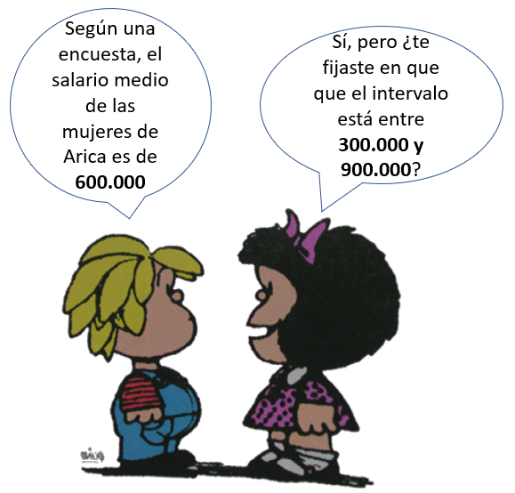
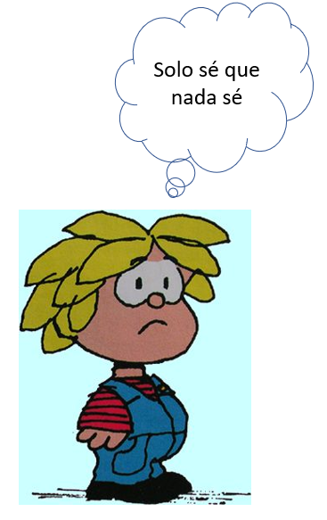
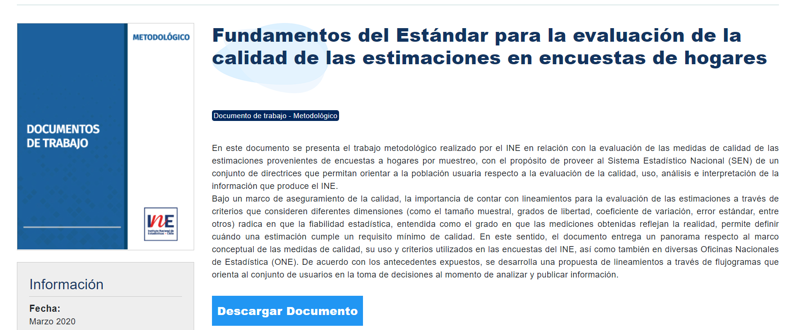
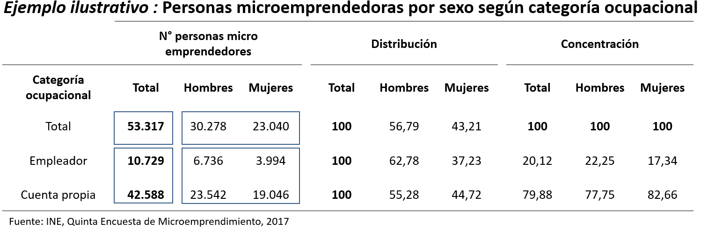
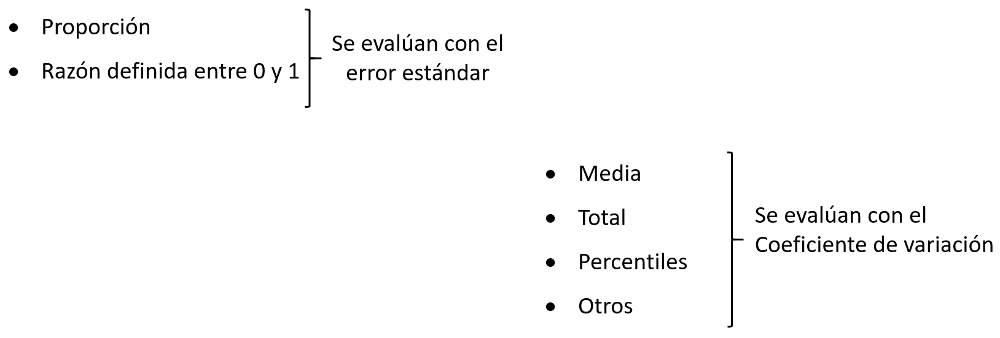
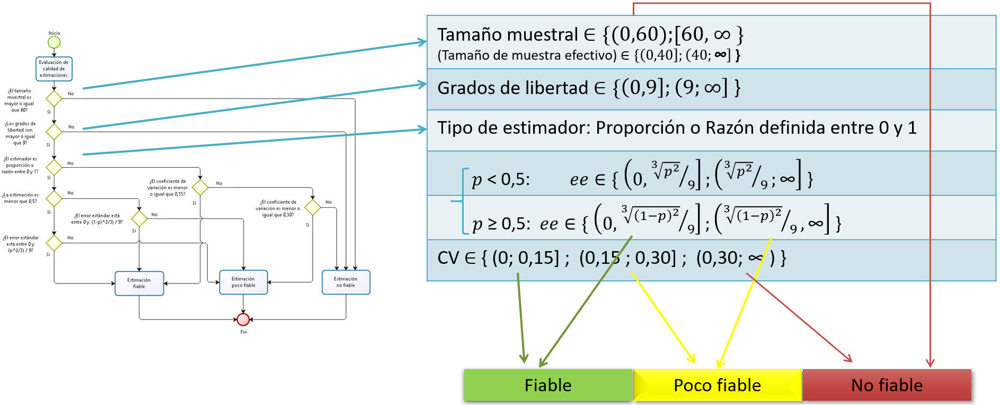
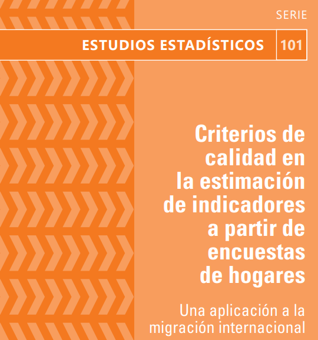
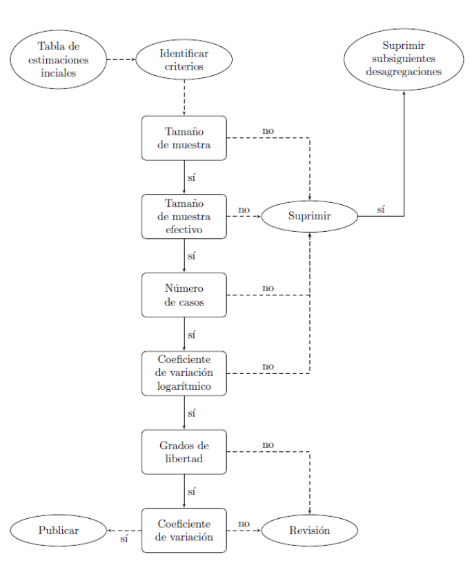
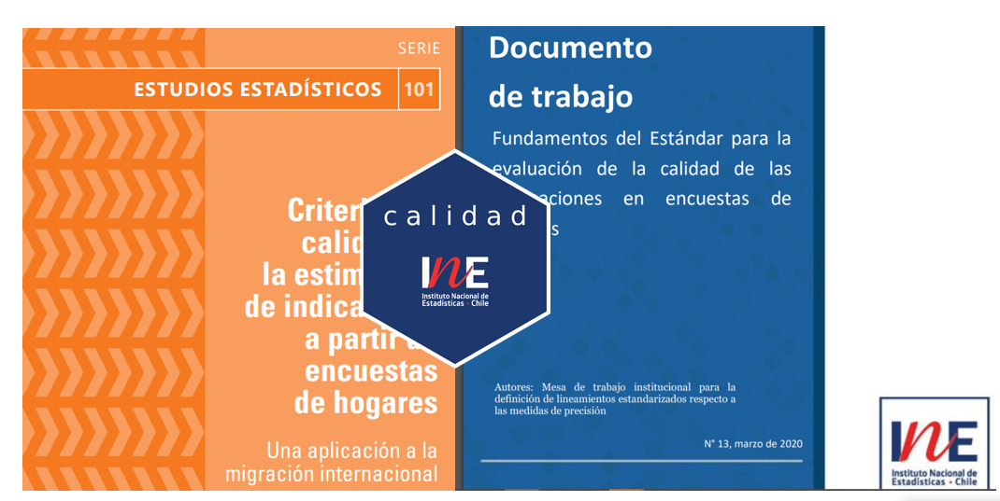

class: center, middle

.linea-superior[]
.linea-inferior[]


## Presentación librería calidad

## Proyecto Estratégico Metodología y Ciencia de Datos para la Producción Estadística 

## Subdirección Técnica

### Octubre 2022

```{r setup, include=FALSE}
options(htmltools.dir.version = TRUE)
knitr::opts_chunk$set(message = FALSE, warning = F) 
options(scipen = "999")
```

```{r xaringan-themer, include=FALSE, warning=FALSE}
library(xaringanthemer)
```

---
background-image: url("imagenes/fondo2.PNG")
background-size: contain;
background-position: 100% 0%

# Contenidos de la presentación

- Estándar de calidad INE

- Estándar de calidad CEPAL

- Paquete de R para implementar estándares


---

class: inverse, center, middle

# Estándar de calidad en encuestas de hogares INE


---

class: inverse, center, middle

# Antes de empezar...


---
background-image: url("imagenes/fondo2.PNG")
background-size: contain;
background-position: 100% 0%

# ¿Qué significa calidad estadística?


.pull-left[


]

--

.pull-right[


]


---

background-image: url("imagenes/fondo2.PNG")
background-size: contain;
background-position: 100% 0%

# Estándar INE

En 2020 el INE publica un estándar de calidad para las estimaciones con **encuestas de hogares**


.center[

]


---

background-image: url("imagenes/fondo2.PNG")
background-size: contain;
background-position: 100% 0%

# Estándar INE

- **Cuadro estadístico**, arreglos ordenados de los datos procesados para facilitar la lectura e interpretación

<br>

.center[

]


---

background-image: url("imagenes/fondo2.PNG")
background-size: contain;
background-position: 100% 0%

# Estándar INE

- **Tamaño muestral (tm)**, unidades de análisis que nutren las estimaciones (viviendas, hogares y/o personas)

* **Grados de libertad (gl)** 
  + .small[Tratamiento diferenciado para las **proporciones y razones definidas entre 0 y 1**]

.center[]

* **Coeficiente de variación / error estándar**

  + Proporción y razones definidas entre 0 y 1: **SE**
  
  + Resto: **CV**


---

background-image: url("imagenes/fondo2.PNG")
background-size: contain;
background-position: 100% 0%

# Dicotomía de las proporciones

<br>
<br>

.center[

]

---

background-image: url("imagenes/fondo2.PNG")
background-size: contain;
background-position: 100% 0%

# Estándar INE

**Indicadores de calidad**

<br>

.center[

]

---

background-image: url("imagenes/fondo2.PNG")
background-size: contain;
background-position: 100% 0%

# Estándar INE

### I Etapa de aplicación de estándar

Flujograma para evaluación de calidad de las estimaciones


.center[

]


---

background-image: url("imagenes/fondo2.PNG")
background-size: contain;
background-position: 100% 0%

# Introducción paquete calidad

### ¿Cómo pasar del documento a la práctica?

.center[

]

--

Existen múltiples herramientas (Stata, R, SAS, Python) y todas son válidas

--

Una posibilidad es el uso de un **paquete (librería)**

--

El paquete `calidad` implementa el estándar mediante `R`


--

### Objetivos del paquete

- Facilitar la aplicación del estándar a usuarios externos

- Aumentar la eficiencia en el trabajo de los analistas

- Reducir la probabilidad de error en la implementación

---

background-image: url("imagenes/fondo2.PNG")
background-size: contain;
background-position: 100% 0%

# Introducción paquete calidad

El paquete `calidad` combina conceptos de calidad con el paquete `survey`, desarrollado por Thomas Lumley


.center[

]

--


**Desde hace un año aproximadamente está en github y hace algunas semanas lo subimos a CRAN**

- media
- proporciones
- ~~mediana (con réplicas)~~
- tamaños (totales poblacionales)
- totales 

---
class: inverse, center, middle

# Implementación en R


---

background-image: url("imagenes/fondo2.PNG")
background-size: contain;
background-position: 100% 0%

# Demostración paquete calidad

Lo primero, es descargar el paquete en su versión estable desde CRAN 

```{r, eval=F}
install.packages("calidad")
```
--

... o versión en desarrollo, desde [github](https://github.com/inesscc/calidad)

```{r, eval=F}
devtools::install_github("inesscc/calidad")
```

--

Cargamos el paquete en la sesión y otras dependencias que usaremos

```{r}
library(calidad)
library(survey)
library(dplyr)
```


---


background-image: url("imagenes/fondo2.PNG")
background-size: contain;
background-position: 100% 0%

# Demostración paquete calidad

Trabajaremos con los datos de la Encuesta de Caracterización Socioeconómica (CASEN) 2020 (cargados en el paquete) 

--

Construyamos algunas variables necesarias para calcular indicadores relevantes del mercado laboral


```{r}
casen_edit <- casen %>% 
  mutate(fdt = if_else(activ %in% c(1, 2), 1, 0, missing = 0), # fuerza de trabajo
         ocupado = if_else(activ == 1, 1, 0, missing = 0), # persona ocupada
         desocupado = if_else(activ == 2, 1, 0, missing = 0), # persona desocupada
         metro = if_else(region == 13, 1, 0)) 

```

**Variables *dummy*:**

- fuerza de trabajo
- ocupado
- desocupado
- metro (pertenece a la región metropolitana)


---

background-image: url("imagenes/fondo2.PNG")
background-size: contain;
background-position: 100% 0%

# Panorama general

Declaramos el diseño complejo con la función `svydesign` de `survey`
```{r}
dc <- svydesign(weights = ~expr, ids = ~cod_upm, strata = ~estrato, data = casen_edit )
options(survey.lonely.psu = "certainty")
```

Debemos decirle a `R` qué hacer con la varianza cuando encuentra estratos con una sola UPM


---
background-image: url("imagenes/fondo2.PNG")
background-size: contain;
background-position: 100% 0%

# Panorama general


El paquete `calidad` tiene 2 tipos de funciones:

- *create_*: **crean** los insumos para el estándar
- *evaluate*:  **evaluación** del estándar

--

Podemos hacer los siguientes cálculos

-  media (create_mean)
-  proporción o razón (create_prop) 
-  suma de variables continuas (create_total) 
-  conteo de unidades (create_size)  


---

background-image: url("imagenes/fondo2.PNG")
background-size: contain;
background-position: 100% 0%

# Creando los insumos: create_mean

Queremos calcular la edad media para mujeres y hombres

--

```{r}
create_mean(var = "edad", domains = "sexo", design = dc)
```

- `var`: variable a estimar
- `domains`: desagregaciones
- `design`: diseño muestral creado con `svydesign`

--

La función genera:
- estimación (stat)
- error estándar (se)
- coeficiente de variación (CV)
- grados de libertad (df)
- tamaño muestral (n)


---
background-image: url("imagenes/fondo2.PNG")
background-size: contain;
background-position: 100% 0%

# Creando los insumos: create_prop

¿Y si queremos calcular la tasa de desempleo?

--

Para ello, contamos con la función `create_prop`


```{r, eval=F}
create_prop(var = "desocupado", domains = "sexo", design = dc)
```

--

El problema es que el desempleo debe calcularse sobre una subpoblación específica (fuerza de trabajo)

--

Para ello, utilizamos el argumento `subpop`

```{r, eval=F}
create_prop(var = "desocupado", domains = "sexo", subpop = "fdt", design = dc)
```

--

Es muy importante considerar que la variable **subpop debe ser dummy** 

--

Con subpop evitamos error en el cálculo de la varianza 

---
background-image: url("imagenes/fondo2.PNG")
background-size: contain;
background-position: 100% 0%

# Creando los insumos: create_prop

¿Qué pasa si queremos desagregar por más variables?

--

Se debe agregar otra variable utilizando un signo +

```{r}
create_prop(var = "desocupado", domains = "sexo+metro", subpop = "fdt", design = dc)

```

---
background-image: url("imagenes/fondo2.PNG")
background-size: contain;
background-position: 100% 0%

# Creando los insumos: create_prop

Queremos calcular el número de ocupad**os** respecto al número de ocupad**as**

$$  \frac{SumaOcupadosHombre}{SumaOcupadasMujer}$$
--

Lo primero que debemos hacer es crear variables auxiliares 

```{r}
casen_edit <- casen_edit %>% 
  mutate(ocupado_hombre = if_else(sexo == 1, ocupado, 0),
         ocupada_mujer  = if_else(sexo == 2, ocupado, 0))
```


Volvemos a declarar el diseño para incluir las variables recién creadas 

```{r}
dc <- svydesign(weights = ~expr, ids = ~cod_upm, strata = ~estrato, data = casen_edit )

```


---

background-image: url("imagenes/fondo2.PNG")
background-size: contain;
background-position: 100% 0%

# Creando los insumos: create_prop

La función `create_prop` permite incluir el argumento `denominator`

```{r}
create_prop(var = "ocupado_hombre", denominator = "ocupada_mujer", 
            subpop = "fdt", design = dc)
```

--

Podemos incluir el parámetro `domains`, si queremos desagregar 


```{r}
create_prop(var = "ocupado_hombre", denominator = "ocupada_mujer", 
            domains = "metro" , subpop = "fdt", design = dc)
```


---

background-image: url("imagenes/fondo2.PNG")
background-size: contain;
background-position: 100% 0%

# Argumentos adicionales

Solo hemos revisado  `create_prop` y `create_mean`

--

Todas las funciones del paquete operan de manera similar

--

Existen más argumentos

- ci
- deff
- rel_error
- ...

--

**Hasta el momento solo hemos visto la generacion de insumos**


.center[

]

---


background-image: url("imagenes/fondo2.PNG")
background-size: contain;
background-position: 100% 0%

# Evaluación del estándar

Evaluemos si la media de edad por sexo cumple con el estándar

--

```{r}
est <- create_mean(var = "edad", domains = "sexo", design =  dc)
evaluate(est)

```

--

Tenemos 4 columnas nuevas

- `eval_n`: indica si el tamaño muestral es sufciente
- `eval_df`: indica si los gl son suficientes
- `eval_cv`: indica el tramo en el que está el cv
- `label`: evaluación final de la estimación

--

Por defecto, las funciones de evaluación consideran el estándar INE

- **Grados de libertad**: 9
- **Tamaño de muestra**: 60
- **Tramos de CV**: 0.15, 0.3


---
background-image: url("imagenes/fondo2.PNG")
background-size: contain;
background-position: 100% 0%

# Evaluación del estándar

Veamos el caso de la tasa de desempleo 

```{r}
est <-  create_prop(var = "desocupado", subpop = "fdt", domains = "sexo", design = dc)
evaluate(est)
```
--

Además de las columnas ya vistas, tenemos 

- `prop_est`
- `eval_type`
- `quadratic`
- `eval_se`
- `eval_cv`

---


background-image: url("imagenes/fondo2.PNG")
background-size: contain;
background-position: 100% 0%

# Evaluación del estándar

El estándar establece que un tabulado puede ser publicado si el 50% de sus celdas es fiable

--

Para saber si el tabulado debe ser publicado, usamos el argumento `publish`

```{r}
est <-  create_size(var = "desocupado", subpop = "fdt", domains = "region+sexo", design = dc)
evaluate(est, publish = T) %>% 
  select(region, sexo, stat, label, publication, pass) %>% 
  slice(1:6)
```

--

Tenemos 2 nuevas columnas

- `publication`: evaluación general del tabulado
- `pass`: porcentaje de celdas con categoría fiable


---

class: inverse, center, middle

# Estándar de calidad CEPAL

---

background-image: url("imagenes/fondo2.PNG")
background-size: contain;
background-position: 100% 0%

# Estándar de calidad CEPAL


.center[

]


---

background-image: url("imagenes/fondo2.PNG")
background-size: contain;
background-position: 100% 0%

# Estándar de calidad CEPAL

* **El estándar CEPAL considera:**
  + .small[coeficiente de variación]
  + .red[.small[coeficiente de variación logarítmico]] 
  + .small[tamaño de muestra]
  + .red[.small[tamaño de muestra efectivo]] 
  + .red[.small[conteo de casos no ponderado]]
  + .small[grados de libertad] 


--

### Nuevas funcionalidades
 

.center[

]


---
background-image: url("imagenes/fondo2.PNG")
background-size: contain;
background-position: 100% 0%

# Nuevos desarrollos con CEPAL

**Nuevos indicadores de calidad**

**Flexibilización de umbrales**

**Alinear nombres con la teoría**

---
background-image: url("imagenes/fondo2.PNG")
background-size: contain;
background-position: 100% 0%

# Estándar de calidad CEPAL


.pull-left[

]


--

.pull-right[

### Suprimir 

### Revisar

### Publicar


]


--

.center[

### ¡Veamos un poco de código! 

]


---

background-image: url("imagenes/fondo2.PNG")
background-size: contain;
background-position: 100% 0%

# Implementación estándar CEPAL

Se deben incluir nuevos parámetros en las funciones `create_`

```{r}
est <- create_size(var = "desocupado", domains = "region+sexo", design = dc, 
                   unweighted = T, deff = T, ess = T, df_type = "eclac") #<<

```

--

Y agregar `r "cepal"`  en evaluate 

```{r}
evaluate(est, scheme = "eclac") %>% #<<
  select(region, sexo, stat, n, df, cv, unweighted, ess, label) %>% 
  slice(1:6)

```


---

background-image: url("imagenes/fondo2.PNG")
background-size: contain;
background-position: 100% 0%

# Estándar CEPAL

¿Y si necesito manejar los parámetros del estándar?

.center[

]


--

```{r}
est <- create_size(var = "desocupado", domains = "region+sexo", design = dc,
                   unweighted = T, deff = T, ess = T, df_type = "ine")

evaluate(est, scheme = "eclac", unweighted = 220, ess = 200) %>% #<<
  select(region, sexo, stat, n, df, cv, unweighted, ess, label) %>% 
  slice(1:6)

```


---

background-image: url("imagenes/fondo2.PNG")
background-size: contain;
background-position: 100% 0%

# Utilización de loops

Queremos calcular la media para varias variables

--

En este caso, queremos la media de `edad` y `ing_aut_hog`, según sexo


```{r, eval=F}

insumos <- data.frame()
for (v in c("edad", "ing_aut_hog")) {
  insumo <- create_mean(var = v, domains = "sexo", design = dc, rm.na = T )  
  insumos <- bind_rows(insumos, insumo)
}


```
--

Podemos hacer lo mismo, utilizando el paquete `purrr` (mucho más recomendado que un for)


```{r, eval=F}
insumos <- map_df(c("edad", "ing_aut_hog"), ~create_mean(var = .x, domains = "sexo",
                                                   design = dc, rm.na = T ))

```


---


background-image: url("imagenes/fondo2.PNG")
background-size: contain;
background-position: 100% 0%

# Combinación de estándares

La idea es generar una herramienta que:

- Implemente los dos estándares

- Ofrezca flexibilidad a los usuarios

.center[

]


---
background-image: url("imagenes/fondo2.PNG")
background-size: contain;
background-position: 100% 0%

# ¿En qué estamos?


* Mantenimiento constante

* Junto a CEPAL estamos preparando instancias de difusión:
  + RTC (aquí estamos)
  + Intersecretariat Working Group on Household Surveys
  
* Preparación de material de difusión 

* Integración de `calidad` con `dataine`

* Comienzo de nuevos desarrollos

---

background-image: url("imagenes/fondo2.PNG")
background-size: contain;
background-position: 100% 0%

# Desarrollo open source

El paquete `calidad` es un desarrollo completamente *open source* 

--

En este [repositorio de github](https://github.com/inesscc/calidad) pueden proponer nuevos desarrollos

--

Klaus Lehmann y Ricardo Pizarro son los mantenedores 

--

Pueden generar *issues* o nuevas ramas de desarrollo 

--

Si tienen **propuestas de mejora, reportes de errores o nuevos desarrollos**, estaremos felices de revisarlo e incorporarlo al paquete  

.center[
### 😄😄😄😄😄
]


- Klaus Lehmann: kilehmannm@ine.gob.cl
- Ignacio Agloni: ifaglonij@ine.gob.cl
- Ricardo Pizarro: rapizarros@ine.gob.cl


.center[


[https://github.com/inesscc/calidad](https://github.com/inesscc/calidad)

]


---

class: center, middle

.linea-superior[]
.linea-inferior[]


## Presentación librería calidad

## Proyecto Estratégico Metodología y Ciencia de Datos para la Producción Estadística 

## Subdirección Técnica

### Octubre 2022
