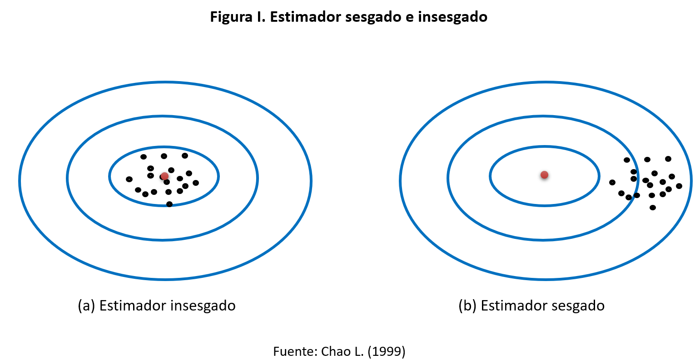
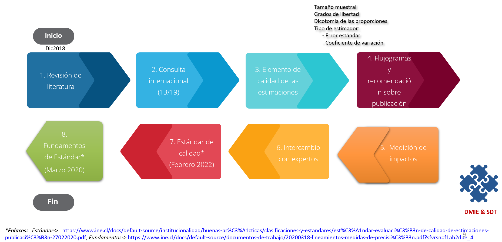
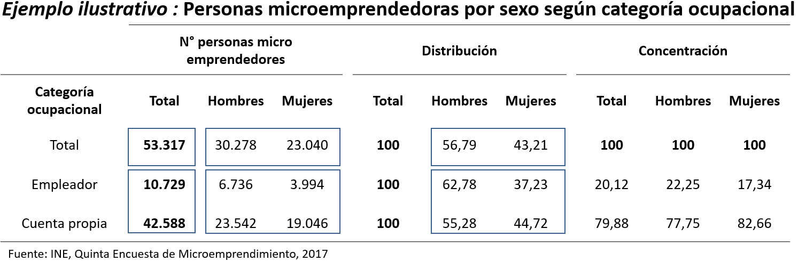
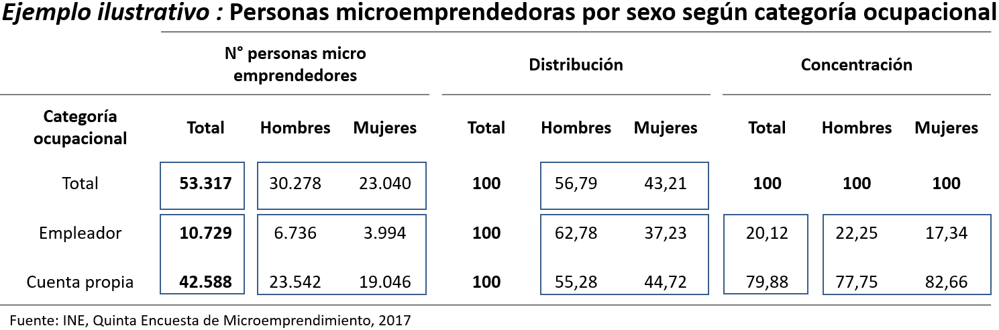
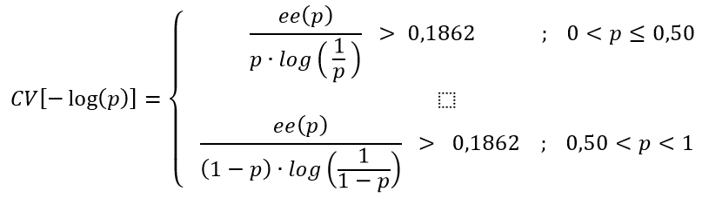
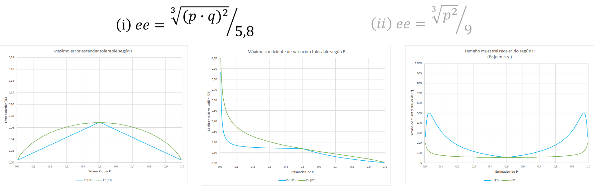
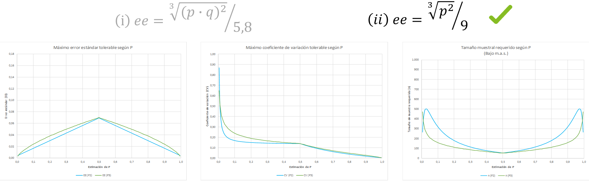

class: center, middle

.linea-superior[]
.linea-inferior[]


## Presentación paquete calidad

## Proyecto Estratégico Servicios Compartidos para la Producción Estadística

## Subdepartamento de Diseño de Marcos y Muestras

### Junio 2021

```{r setup, include=FALSE}
options(htmltools.dir.version = TRUE)
knitr::opts_chunk$set(message = FALSE, warning = F) 
options(scipen = "999")
```

```{r xaringan-themer, include=FALSE, warning=FALSE}
library(xaringanthemer)
```

---
background-image: url("imagenes/fondo2.PNG")
background-size: contain;
background-position: 100% 0%

# Contenidos de la presentación

- Contexto 

- Estándar de calidad en encuestas de hogares

- Paquete de R para implementar el Estándar

---

class: inverse, center, middle

# I. Contexto


---

background-image: url("imagenes/fondo2.PNG")
background-size: contain;
background-position: 100% 0%

# Contexto

- Las encuestas por muestreo como fuente de información

--

- Principio de representatividad de las encuestas por muestreo

--

- Criterios previos para evaluar la calidad de las estimaciones

--

- Disposición de las bases de datos asociadas a las encuestas por muestreo


---

background-image: url("imagenes/fondo2.PNG")
background-size: contain;
background-position: 100% 0%

# Calidad de las estimaciones


- Calidad como concepto multidimensional

--

- Dimensión de Acuracidad, Confiabilidad o Precisión

--

- Fuentes de error de las encuestas: Errores de muestreo y Errores ajenos al muestreo

--

- Medida predilecta para medir la calidad: El error cuadrático medio

<br>

$$ECM(\hat{\theta}) = E[\hat{\theta} - \theta]^2 = \sigma^2( \hat{\theta}) + (E[\hat{\theta}] - \theta)^2 $$
.center[
$\sigma^2( \hat{\theta}) : \text{Varianza del estimador}$

$E[\hat{\theta}] - \theta: \text{sesgo}$

]

---
background-image: url("imagenes/fondo2.PNG")
background-size: contain;
background-position: 100% 0%

# Calidad de las estimaciones

.center[


]

---

class: inverse, center, middle

# II.Estándar de calidad en encuestas de hogares


---

background-image: url("imagenes/fondo2.PNG")
background-size: contain;
background-position: 100% 0%

# Actividades desarrolladas

<br>

.center[


]

---


background-image: url("imagenes/fondo2.PNG")
background-size: contain;
background-position: 100% 0%

# Consideraciones aplicadas

- **Cuadro estadístico**, arreglos ordenados de los datos procesados para facilitar la lectura e interpretación

- **Tabulado**, expresión gráfica que sintetiza un valor o estimación producto del cruce de variables

<br>

.center[

]


---

background-image: url("imagenes/fondo2.PNG")
background-size: contain;
background-position: 100% 0%

# Consideraciones aplicadas

- **Cuadro estadístico**, arreglos ordenados de los datos procesados para facilitar la lectura e interpretación

- **Tabulado**, expresión gráfica que sintetiza un valor o estimación producto del cruce de variables

<br>

.center[

]


---

background-image: url("imagenes/fondo2.PNG")
background-size: contain;
background-position: 100% 0%

# Consideraciones aplicadas

- **Cuadro estadístico**, arreglos ordenados de los datos procesados para facilitar la lectura e interpretación

- **Tabulado**, expresión gráfica que sintetiza un valor o estimación producto del cruce de variables

<br>

.center[

]


---

background-image: url("imagenes/fondo2.PNG")
background-size: contain;
background-position: 100% 0%

# Consideraciones aplicadas

- **Cuadro estadístico**, arreglos ordenados de los datos procesados para facilitar la lectura e interpretación

- **Tabulado**, expresión gráfica que sintetiza un valor o estimación producto del cruce de variables

<br>

.center[

]


---
background-image: url("imagenes/fondo2.PNG")
background-size: contain;
background-position: 100% 0%

# Consideraciones aplicadas

- **Estimador**, es un estadístico (es decir, una función de la muestra) usado para estimar un parámetro desconocido de la población.

<br>

.center[

]

---

background-image: url("imagenes/fondo2.PNG")
background-size: contain;
background-position: 100% 0%

# Consideraciones aplicadas

- **Tamaño muestral (tm)**, unidades de análisis que nutren las estimaciones y abarca: viviendas, hogares y/o personas.

- **Grados de libertad (gl)** 


.center[

]


- **Proporción y razones definidas entre 0 y 1**, el cálculo de los 𝑑𝑓 y 𝑡𝑚 se realiza  sobre las unidades de análisis en la subpoblación que participan en el “Denominador”.

- **Resto**, el cálculo se realiza tomando en cuenta las unidades de análisis que participan en la estimación. 


---

background-image: url("imagenes/fondo2.PNG")
background-size: contain;
background-position: 100% 0%

# Dicotomía de las proporciones

<br>
<br>

.center[

]

---

background-image: url("imagenes/fondo2.PNG")
background-size: contain;
background-position: 100% 0%

# Funciones evaluadas para el SE


### Enfoque de la recta y del CV logarítmico


.center[]


.footnote[
Notas:

[1] La recta que pasa por los puntos: (0,01 ; 0,005) y (0,20; 0,03) quedando como CV los valores 0,50 y 0,15, respectivamente.

[2]  El valor 0,1862 en la última función del máximo 𝑒𝑒 tolerable, constituye el valor que toma esta función evaluada en 𝑝=0,50, en el contexto de un muestreo aleatorio simple y considerando un tamaño muestral de 𝑛=60 unidades. Similar ejercicio se encuentra en Hornik, et al. (2002) y Walker (2003) utilizando 𝑛=41  y 𝑛=68, respectivamente.
]


---
class: animated, fadeIn

background-image: url("imagenes/fondo2.PNG")
background-size: contain;
background-position: 100% 0%

# Funciones evaluadas para el SE

### Enfoque de la recta y del CV logarítmico

.center[]


.footnote[
Notas:

[1] La recta que pasa por los puntos: (0,01 ; 0,005) y (0,20; 0,03) quedando como CV los valores 0,50 y 0,15, respectivamente.

[2]  El valor 0,1862 en la última función del máximo 𝑒𝑒 tolerable, constituye el valor que toma esta función evaluada en 𝑝=0,50, en el contexto de un muestreo aleatorio simple y considerando un tamaño muestral de 𝑛=60 unidades. Similar ejercicio se encuentra en Hornik, et al. (2002) y Walker (2003) utilizando 𝑛=41  y 𝑛=68, respectivamente.
]

---

background-image: url("imagenes/fondo2.PNG")
background-size: contain;
background-position: 100% 0%

# Funciones evaluadas para el SE

### Funciones evaluadas adicionalmente

.center[]


---

background-image: url("imagenes/fondo2.PNG")
background-size: contain;
background-position: 100% 0%

# Funciones evaluadas para el SE

### Funciones evaluadas adicionalmente

.center[]


---
background-image: url("imagenes/fondo2.PNG")
background-size: contain;
background-position: 100% 0%

# Estándar de calidad encuestas de hogares

### I Etapa de aplicación de estándar

Flujograma para evaluación de calidad de las estimaciones

.center[

]

---

background-image: url("imagenes/fondo2.PNG")
background-size: contain;
background-position: 100% 0%

# Estándar de calidad encuestas de hogares

### I Etapa de aplicación de estándar

Flujograma para evaluación de calidad de las estimaciones


.center[

]


---

background-image: url("imagenes/fondo2.PNG")
background-size: contain;
background-position: 100% 0%

# Estándar de calidad encuestas de hogares

### I Etapa de aplicación de estándar

Flujograma para evaluación de calidad de las estimaciones


.center[

]

---
background-image: url("imagenes/fondo2.PNG")
background-size: contain;
background-position: 100% 0%

# Estándar de calidad encuestas de hogares

### I Etapa de aplicación de estándar

Flujograma para evaluación de calidad de las estimaciones


.center[

]


---

background-image: url("imagenes/fondo2.PNG")
background-size: contain;
background-position: 100% 0%

# Estándar de calidad encuestas de hogares

### I Etapa de aplicación de estándar

Flujograma para evaluación de calidad de las estimaciones


.center[

]

---
background-image: url("imagenes/fondo2.PNG")
background-size: contain;
background-position: 100% 0%

# Estándar de calidad encuestas de hogares

### I Etapa de aplicación de estándar

Flujograma para evaluación de calidad de las estimaciones


.center[

]

---

background-image: url("imagenes/fondo2.PNG")
background-size: contain;
background-position: 100% 0%

# Estándar de calidad encuestas de hogares

### I Etapa de aplicación de estándar

Flujograma para evaluación de calidad de las estimaciones


.center[

]


---

background-image: url("imagenes/fondo2.PNG")
background-size: contain;
background-position: 100% 0%

# Estándar de calidad encuestas de hogares

### II Etapa de aplicación de estándar

Flujograma para evaluación de calidad de los tabulados

.center[

]


---
class: inverse, center, middle

# ¿Consultas?


---

class: inverse, center, middle

# III.Paquete de R para implementar el Estándar


---

background-image: url("imagenes/fondo2.PNG")
background-size: contain;
background-position: 100% 0%

# Introducción paquete calidad

### ¿Cómo pasar del documento a la práctica?

.center[

]

--

Existen múltiples herramientas (Stata, R, SAS, Python) y todas son válidas

--

Múltiples modalidades dentro de cada herramienta (libertad total, scripts estandarizados, funciones, etc.)

--

Es útil contar con una herramienta que **estandarice** los criterios de calidad


---

background-image: url("imagenes/fondo2.PNG")
background-size: contain;
background-position: 100% 0%

# Introducción paquete calidad

Una posibilidad es el uso de un **paquete (librería)**

--

El paquete `calidad` implementa el estándar mediante `R`

--

### ¿Por qué `R`?

--

- El INE está avanzando decididamente en la incorporación de `R` a sus procesos    

--

- Es una herramienta gratuita

--

- Permite empaquetar soluciones de manera sencilla

--

- Rápida absorción de los avances estadísticos (SAE, detección de outliers, imputación, etc.)

--

### Objetivos del paquete

- Facilitar la aplicación del estándar a usuarios externos

- Aumentar la eficiencia en el trabajo de los analistas

- Reducir la probabilidad de error en la implementación

--

---

background-image: url("imagenes/fondo2.PNG")
background-size: contain;
background-position: 100% 0%

# Introducción paquete calidad

El paquete `calidad` combina el estándar del INE con el paquete `survey`, desarrollado por Thomas Lumley


.center[

]

--

.center[
### Revisaremos velozmente el paquete survey
]


---

background-image: url("imagenes/fondo2.PNG")
background-size: contain;
background-position: 100% 0%

# Brevísima revisión de survey

Usaremos los datos de CASEN 2017

```{r}
library(tidyverse)
library(feather)

casen <- read_feather("data/Casen 2017.feather")


```

--

Construyamos algunas variables necesarias para calcular indicadores relevantes del mercado laboral

```{r}
casen <- casen %>% 
  mutate(fdt = if_else(activ %in% c(1, 2), 1, 0, missing = 0), # fuerza de trabajo
         ocupado = if_else(activ == 1, 1, 0, missing = 0), # persona ocupada
         desocupado = if_else(activ == 2, 1, 0, missing = 0), # persona desocupada
         metro = if_else(region == 13, 1, 0),
         num = if_else(row_number() <= 1, 1, 0),
         denom = 1) 


```

```{r, include=F, echo=F}

keys <- casen %>% 
  group_by(varunit) %>% 
  slice(1) %>% 
  ungroup() %>% 
  mutate(varunit2 = row_number()) %>% 
  select(varunit2, varunit)

casen <- casen %>% 
  left_join(keys, by = "varunit") %>% 
  select(-varunit) %>% 
  rename(varunit = varunit2)

```


---
background-image: url("imagenes/fondo2.PNG")
background-size: contain;
background-position: 100% 0%

# Brevísima revisión de survey

En primer lugar, declaramos el diseño complejo con la función `svydesign`
```{r}
library(survey)
dc <- svydesign(weights = ~expr, ids = ~varunit, strata = ~varstrat, data = casen )

```

Debemos declarar:
- conglomerados de varianza
- estratos de varianza
- factor de expansión

--

Es importante indicarle a `survey` qué hacer cuando existen estratos que solo tienen una UPM 

```{r}
options(survey.lonely.psu = "certainty")
```


---
background-image: url("imagenes/fondo2.PNG")
background-size: contain;
background-position: 100% 0%

# Brevísima revisión de survey

### Ahora podemos usar los paquetes `survey` y  `calidad` 😃😃😃😃😃

--

**Calculemos la tasa de desempleo**

```{r}
svymean(x = ~desocupado, subset(dc, fdt == 1))

```
--

**También podríamos calcularla así**

```{r}
svyby(formula = ~desocupado, design = dc, by = ~fdt, FUN = svymean)
```
--

**O así...**

```{r, eval=F}
svyratio(numerator = ~desocupado, denominator = ~fdt, subset(dc, fdt == 1))
```
---
background-image: url("imagenes/fondo2.PNG")
background-size: contain;
background-position: 100% 0%

# Brevísima revisión de survey

`survey` permite hacer una infinidad de cálculos 

- `svymean`
- `svytotal`
- `svyratio`
- `svyby`
- `svyquantile`

--

Mediante la función `as.svrepdesign` podemos, además, utilizar métodos de remuestreo

- intervalos de confianza de percentiles
- cv de percentiles

--

.center[
### El paquete survey es una gran herramienta que nos hace la vida más fácil 
]

.center[

]


---
background-image: url("imagenes/fondo2.PNG")
background-size: contain;
background-position: 100% 0%

# Instalación paquete calidad

Lo primero, es descargar el paquete desde [github](https://github.com/inesscc/calidad)

Se requiere el paquete `devtools`

```{r, eval=F}
library(devtools)
install_github("inesscc/calidad")
```

--

### En la consola, aparecerá el siguiente mensaje


.center[

]

### Debes escribir 3 en la consola y luego enter

---
background-image: url("imagenes/fondo2.PNG")
background-size: contain;
background-position: 100% 0%

# Panorama general

Lo siguiente, es cargar el paquete en la sesión

```{r}
library(calidad)
```

El paquete `calidad` tiene 2 grandes familias de funciones:

- *create_*: permiten **crear** los insumos para el estándar
- *evaluate_*: permiten hacer la **evaluación** del estándar

--

Podemos hacer los siguientes cálculos

- `create_mean`: calcular la media (ingreso)
- `create_prop`: proporción o razón (ocupación) 
- `create_tot`: conteo de unidades (ocupación)
- `create_tot_con`: suma de variables continuas (ingreso)
- `create_median`: mediana (ingreso)

--

### Estas funciones devuelven la estimación y los insumos para el estándar

---
background-image: url("imagenes/fondo2.PNG")
background-size: contain;
background-position: 100% 0%

# Panorama general

Queremos calcular la edad media para mujeres y hombres

--

```{r}
create_mean(var = edad, dominios = sexo, disenio = dc)
```

- `var`: variable a estimar
- `dominios`: desagregaciones
- `disenio`: diseño muestral creado con `svydesign`

--

La función genera:
- estimación 
- error estándar (se)
- grados de libertad (gl)
- tamaño muestral (n)


---
background-image: url("imagenes/fondo2.PNG")
background-size: contain;
background-position: 100% 0%

# Panorama general

A diferencia de `survey`, en el paquete `calidad` no es necesario utilizar "~"  

```{r, eval=F}
# Argumentos con paquete survey
svyby(formula = ~edad, by = ~sexo, design =  dc, FUN = svymean) 
```


--

Tampoco se requiere que los argumentos estén escritos como *strings*

--

Sin embargo, existe la libertad para usar *strings*

```{r}
# Argumentos con paquete calidad
create_mean(var = "edad", dominios = sexo,  disenio = dc)

```

--

Ya veremos por qué podría ser útil que los argumentos sean strings

.center[

]


---
background-image: url("imagenes/fondo2.PNG")
background-size: contain;
background-position: 100% 0%

# Creando los insumos: create_prop

Volvamos al caso de la tasa de desempleo

--

Para ello, contamos con la función `create_prop`

--

Podríamos hacer algo similar a lo anterior


```{r, eval=F}

create_prop(var = desocupado, dominios = sexo, disenio = dc)
```

--

El problema es que el desempleo debe calcularse sobre una subpoblación específica (fuerza de trabajo)

--

Para ello, utilizamos el argumento `subpop`

```{r, eval=F}
create_prop(var = desocupado, dominios = sexo, subpop = fdt, disenio = dc)
```

--

Es muy importante considerar que la variable **subpop debe ser dummy** 


---
background-image: url("imagenes/fondo2.PNG")
background-size: contain;
background-position: 100% 0%

# Creando los insumos: create_prop

¿Qué pasa si queremos desagregar por más variables?

--

Se debe agregar otra variable utilizando un signo +

```{r}
create_prop(var = desocupado, dominios = sexo+metro, subpop = fdt, disenio = dc)

```

---
background-image: url("imagenes/fondo2.PNG")
background-size: contain;
background-position: 100% 0%

# Creando los insumos: create_prop

Queremos calcular el número de ocupad**os** respecto al número de ocupad**as**

$$  \frac{SumaOcupadosHombre}{SumaOcupadasMujer}$$
--

Lo primero que debemos hacer es crear variables auxiliares 

```{r}
casen <- casen %>% 
  mutate(ocupado_hombre = if_else(sexo == 1, ocupado, 0),
         ocupada_mujer  = if_else(sexo == 2, ocupado, 0))
```


Volvemos a declarar el diseño para incluir las variables recién creadas 

```{r}
dc <- svydesign(ids = ~varunit, strata = ~varstrat, weights = ~expr,  data = casen )
```


---

background-image: url("imagenes/fondo2.PNG")
background-size: contain;
background-position: 100% 0%

# Creando los insumos: create_prop

La función `create_prop` permite incluir el argumento `denominador`

```{r}
create_prop(var = ocupado_hombre, denominador = ocupada_mujer, 
            subpop = fdt, disenio = dc)


```
--

Podemos agregar el parámetro `dominios`, si queremos desagregar 


```{r}
create_prop(var = ocupado_hombre, denominador = ocupada_mujer, 
            dominios = metro , subpop = fdt, disenio = dc)

```


---
background-image: url("imagenes/fondo2.PNG")
background-size: contain;
background-position: 100% 0%

# Creando los insumos: median-mean

Para calcular la media de edad por sexo, usamos la función `create_mean`

```{r}
create_mean(var = edad, dominios = sexo, disenio = dc)
```
--

Para calcular la mediana, usamos `create_median`

En este caso, el valor por defecto para el número de réplicas es 10, pero podemos elegir el valor deseado

```{r}
create_median(var = edad, dominios = sexo, disenio = dc, replicas = 20)
```

--

.red[¡¡El tiempo de ejecución aumenta significativamente con el número de réplicas!!]


---
background-image: url("imagenes/fondo2.PNG")
background-size: contain;
background-position: 100% 0%

# Creando los insumos: create_tot

Si queremos un conteo de casos, podemos usar `create_tot`

--

Por ejemplo, número de ocupados por sexo

--

```{r}
create_tot(var = desocupado, dominios = sexo, subpop = fdt, disenio = dc)

```

--

.red[Se requiere que la variable a estimar sea dummy]

```{r, error=T, eval=T}
create_tot(var = region, dominios = sexo, subpop = fdt, disenio = dc)

```


---

background-image: url("imagenes/fondo2.PNG")
background-size: contain;
background-position: 100% 0%

# Argumentos adicionales

Hasta el momento hemos revisado 

- `create_prop`
- `create_mean`
- `create_median`
- `create_tot`

--

Todas las funciones del paquete operan de manera similar


---
background-image: url("imagenes/fondo2.PNG")
background-size: contain;
background-position: 100% 0%

<br>
<br>
<br>
<br>
<br>

.center[
  .big[Evaluación del estándar] 
]


---
background-image: url("imagenes/fondo2.PNG")
background-size: contain;
background-position: 100% 0%

# Evaluación del estándar

Existe una función de evaluación para cada tipo de estimación

- `evaluate_mean`
- `evaluate_prop`
- `evaluate_tot`
- `evaluate_tot_con`
- `evaluate_median`

--

Estas funciones reciben como argumento la tabla creada por las funciones `create_*`


---
background-image: url("imagenes/fondo2.PNG")
background-size: contain;
background-position: 100% 0%

# Evaluación del estándar

Evaluemos si la media de edad por sexo, cumple con el estándar

--

```{r}
est <- create_mean(var = edad, dominios = sexo, disenio = dc)
evaluate_mean(est)

```

--

Tenemos 4 columnas nuevas

- `eval_n`: indica si el tamaño muestral es sufciente
- `eval_gl`: indica si los gl son suficientes
- `eval_cv`: indica el tramo en el que está el cv
- `calidad`: evaluación final de la estimación


---
background-image: url("imagenes/fondo2.PNG")
background-size: contain;
background-position: 100% 0%

# Evaluación del estándar

Veamos el caso de la tasa de desempleo 

```{r}
est <-  create_prop(var = desocupado, dominios = sexo, disenio = dc)
evaluate_prop(est)
```
--

Además de las columnas ya vistas, tenemos 

- `prop_est`
- `tipo_eval`
- `cuadratica`
- `eval_se`
- `eval_cv`

---

background-image: url("imagenes/fondo2.PNG")
background-size: contain;
background-position: 100% 0%

# Evaluación del estándar

Veamos qué pasa con las proporciones que son mayores a 1  

```{r}
casen <- casen %>% 
  mutate(casado = if_else(ecivil == 5, 1, 0), # separado
         conviviente  = if_else(ecivil == 6, 1, 0)) # divorciado 
dc <- svydesign(ids = ~varunit, strata = ~varstrat, weights = ~expr,  data = casen )

```


```{r}
est <- create_prop(var = casado, 
                   denominador = conviviente,
                   dominios = metro, 
                   disenio = dc )
evaluate_prop(est)

```

--

**En este caso, usamos el CV para hacer la evaluación y no el SE** 


---
background-image: url("imagenes/fondo2.PNG")
background-size: contain;
background-position: 100% 0%

# Evaluación del estándar

El estándar establece que un tabulado puede ser publicado si el 50% de sus celdas es fiable

--

Para saber si el tabulado debe ser publicado, usamos el argumento `publicar`

```{r}
est <-  create_tot(var = desocupado, dominios = region+sexo, disenio = dc)
evaluate_tot(est, publicar = T) %>% 
  select(region, sexo, total, publicacion, aprueba) %>% 
  slice(1:6)
```

--

Tenemos 2 nuevas columnas

- `publicacion`: evaluación general del tabulado
- `aprueba`: porcentaje de celdas con categoría fiable

---

background-image: url("imagenes/fondo2.PNG")
background-size: contain;
background-position: 100% 0%

# Visualización estándar

La función `tabla_html` aún está en desarrollo, pero ya está disponible para ser usada

Recibe como argumento el output de `evaluate` 


```{r}

hogares <- casen %>% 
  filter(pco1 == 1) 
dc <- svydesign(ids = ~varunit, strata = ~varstrat, weights = ~expr,  data = hogares )
est <- create_mean(var = yautcorh, dominios = region+sexo+ecivil, disenio = dc)
tabla_html(evaluate_tot(est) %>% group_by((calidad)) %>%  slice(1:2))  


```


---
background-image: url("imagenes/fondo2.PNG")
background-size: contain;
background-position: 100% 0%

# Utilización de loops

Queremos calcular la media para varias variables

--

En este caso, queremos la media de `edad` y `curso`, según sexo

--

Podemos generar un loop, agregando el parámetro `standard_eval = T`


```{r}

insumos <- data.frame()
for (var in c("edad", "esc")) {
  insumo <- create_mean(var = var, dominios = "sexo", disenio = dc,
                        standard_eval = T, rm.na = T )  
  insumos <- bind_rows(insumos, insumo)
}


```
--

Podemos hacer lo mismo, utilizando el paquete `purrr` (mucho más recomendado que un for)


```{r}
insumos <- map_df(c("edad", "esc"), ~create_mean(var = .x, dominios = "sexo",
                                                   disenio = dc, standard_eval = T, rm.na = T ))

```


---

background-image: url("imagenes/fondo2.PNG")
background-size: contain;
background-position: 100% 0%

# Desarrollo open source

El paquete `calidad` es un desarrollo completamente *open source* 

--

Estos proyectos se nutren del aporte de la comunidad

--

En este [repositorio de github](https://github.com/inesscc/calidad) pueden proponer nuevos desarrollos

--

Klaus Lehmann y Ricardo Pizarro son los mantenedores 

--

Pueden generar *issues* o nuevas ramas de desarrollo 

--

Si tienen propuestas de mejora o nuevos desarrollos, estaremos felices de revisarlo e incorporarlo al paquete  

.center[
### 😄😄😄😄😄
]

---

background-image: url("imagenes/fondo2.PNG")
background-size: contain;
background-position: 100% 0%

# Desarrollo aplicativo web

Este paquete busca ayudar a usuarios externos que trabajen con `R`

--

El lenguaje de programación sigue siendo una barrera 

--

.center[

]

--

.center[

]


--

### ¡Veamos la aplicación!

---

class: center, middle

.linea-superior[]
.linea-inferior[]


## Presentación paquete calidad

## Proyecto Estratégico Servicios Compartidos para la Producción Estadística

## Subdepartamento de Diseño de Marcos y Muestras

### Junio 2021
